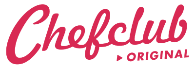
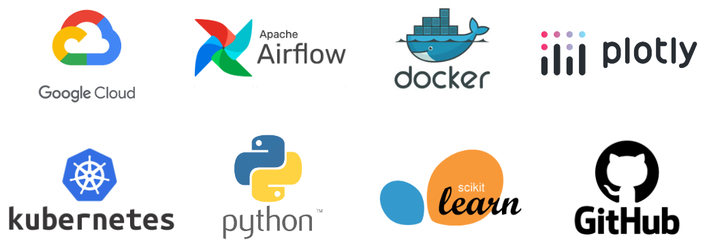

  <h1></h1>
  <h2>Chefclub Data Engineer / Data Scientist Internship</h2>
  
📢 Take a look at the <a href="materials/PFE LABRIJI SAAD.pdf">End of Study Report</a> for a detailed view of this internship!

---

**Welcome** to the repository that captures my journey as a **Data Engineer / Data Scientist** intern at **Chefclub**, a respected digital cooking brand 🍽️ based in Paris.

## Overview 🌟

- **Company**: Chefclub
- **Duration**: January 2023 - July 2023 (6 months)
- **Location**: Paris, Île-de-France, France
- **Type**: Data Engineer / Data Scientist Internship

## Objective 🚀

My main focus during this internship was to **strengthen Chefclub's data groundwork** by refining how we gather, store, and study information. This mission aimed to help the company effectively use data from social media. I got hands-on with a toolkit that included **Data Engineering, Cloud Computing, Data Science, and Data Analytics**.

## Accomplishments 🏆

Throughout the internship, I achieved the following milestones:

1. **`YouTube Data Retrieval System`**: I conceptualized and implemented a YouTube data retrieval system, utilizing a range of technologies such as Airflow, Kubernetes, Docker, Python, GitHub, the YouTube Analytics API, and SQL. This system automates the collection and storage of performance data from Chefclub's YouTube channels, feeding it into BigQuery and Cloud Storage. Moreover, it generates dynamic reports in Looker Studio and financial reports in Google Sheets. The architecture of the system is visually depicted below:

  <h1></h1>
  
<i>Fig 1 : </i>YouTube Analytics Data Retrieval Solution

2. **`Facebook Post Performance Analysis`**: I conducted an in-depth analysis of Chefclub's Facebook data to uncover valuable trends and insights. This analysis facilitated the identification of top-performing videos. The workflow utilized for this analysis is illustrated here:

  <h1></h1>
  
<i>Fig 2 : </i> Data Analysis Workflow for Facebook Posts

3. **`Forecasting Facebook Posts Performance in Slack`**: I developed and integrated an automated machine learning model using Airflow, BigQuery, Jupyter Notebook, Scikit-Learn, and Docker. This model, updated daily, delivers forecasts of Facebook post performance based on historical page health. It is integrated with a Google Cloud Function for Slack communication. The workflow and integration process are presented below:

  <h1></h1>
  
<i>Fig 3 : </i> Model Training Deployment  Solution

Additionally, an overview of the model inference process via Slack is explained in the sequence diagram below:

  <h1></h1>
  
<i>Fig 4 : </i> Sequence Diagram  Model Inference via Slack

These solutions collectively enhanced Chefclub's decision-making capabilities and deepened their understanding of social media performance.

## Methodology 📈

For this internship, we followed an agile project management approach, specifically using the **SCRUM methodology**. This helped us work flexibly and efficiently, ensuring successful results.

## Tools and Technologies 🛠️

During the internship, I utilized a variety of tools and technologies, with the main ones being:

  <h1></h1>

- **Google Cloud Platform (GCP)**: Used as the primary cloud provider.
- **Airflow**: Employed for scheduling and orchestrating jobs.
- **Docker**: Utilized to encapsulate custom Python code into containers.
- **Kubernetes**: Employed for efficient management of Docker containers, orchestrated by Airflow jobs.
- **Python**: The primary programming language used for developing our solutions.
- **Plotly**: Empowered us to create visually interactive graphs.
- **Scikit-learn**: A robust library used for implementing various Machine Learning algorithms.
- **GitHub**: The chosen platform for collaborative development and version control of our code.
## Author 👤

- 🔗 Feel free to connect with me on <a href="https://www.linkedin.com/in/labrijisaad/">LinkedIn</a>
